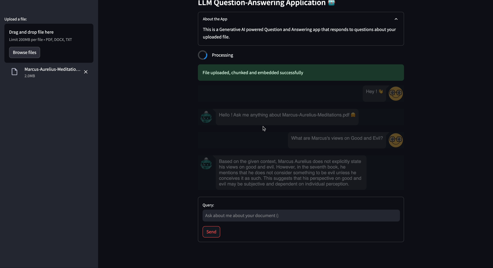
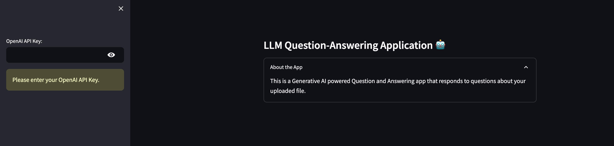
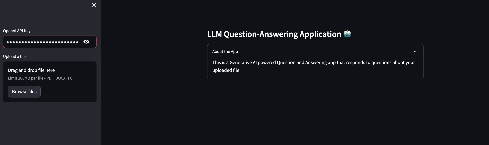

# LLM Question-Answering Application



This app is available for demo at [LLM Question-Answering Application](https://jacobj215-llm-qna-chat-bot-app-yzhsmu.streamlit.app/)


[GitHub](https://github.com/JacobJ215/LLM-QnA-CHAT-BOT)

## Overview

The LLM Question-Answering Application offers a user-friendly interface for seamlessly extracting insights from documents. Users kickstart the process by providing their OpenAI API keys. Following this, they can upload documents in PDF, DOCX, or TXT formats. The application then begins processing, chunking, and embedding the content employing the `all-MiniLM-L6-v2` model from HuggingFace. This innovative approach ensures users incur no charges for generating embeddings, with processing times averaging between 1 to 2 minutes, contingent on file size and computational resources.

Once the document is prepped, the embeddings are securely stored in a vector store through FAISS, a powerful open-source library adept at efficient similarity searches and clustering of dense vectors. With the document processing complete, users can then submit their queries. After roughly a minute, the application serves up the desired response, effectively providing an efficient and hassle-free experience for accessing pertinent information from uploaded documents.

## Tools Used

- LangChain
- FAISS
- OpenAI
- HuggingFaceEmbeddings
- Streamlit


## How to run the app

1. Click [Streamit App](https://jacobj215-llm-qna-chat-bot-app-yzhsmu.streamlit.app/)

2. Enter OpenAI API Key: Since our application uses Open AI's `gpt-3.5-turbo`, you will be required to enter in your api key





3. Upload your document: Upload your document (PDF, DOCX, TXT) by either drag and drop or by browsing your files.

4. Enter your query and click send. 


## How to run locally

1. **Clone the Repository:** Clone this GitHub repository to your local machine.

2. **Set Up the Environment:** Create a virtual environment (optional but recommended) and install the required packages listed in the `requirements.txt` file:
   
   ```
   pip install -r requirements.txt
   ```

3. Run the App: execute the following command to run the Flask app:xecute the following command to run the Flask app:

    ```bash
    streamlit app.py
    ```


4. Access the App: Open a web browser and navigate to http://127.0.0.1:5000/ to access the app.

5. Enter OpenAI API Key: Since our application uses Open AI's `gpt-3.5-turbo`, you will be required to enter in your api key.

6. Upload your document: Upload your document (PDF, DOCX, TXT) by either drag and drop or by browsing your files.

7. Enter your query and click send. 